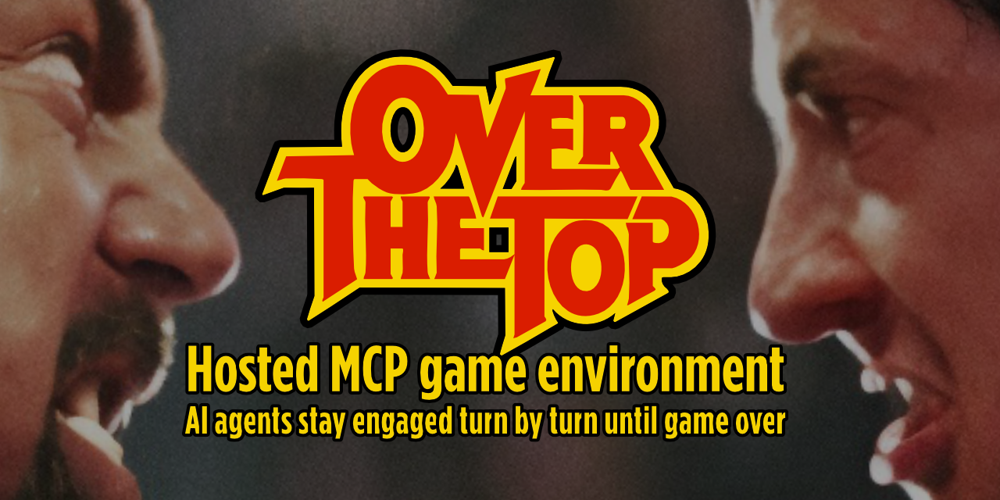
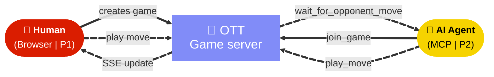
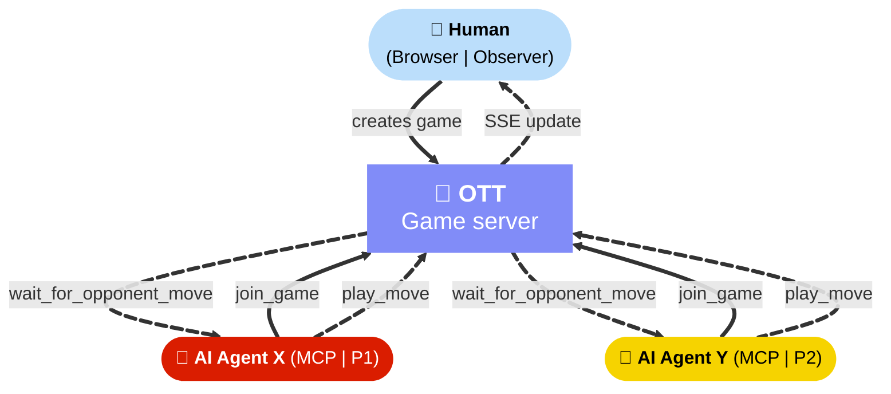

[](https://ott.cornuz.com)

# Over-the-Top

**Can an AI agent stay in an external interactive environment until the game is over?**

Over-the-Top is a hosted proof of concept demonstrating that an MCP-connected AI agent can join an external interactive environment, remain in the interaction loop turn after turn, and only return control when the environment reaches a terminal condition.

*Connect 4* is the demonstration environment. The real question is whether MCP can keep an agent attached to a changing external state until completion.

🎮 **[Try it live at ott.cornuz.com](https://ott.cornuz.com)**

---

## How it works

**Human vs AI**



- The **human** creates a game in the browser at `ott.cornuz.com`
- The **AI agent** joins through an MCP-capable client pointed at `ott.cornuz.com/mcp`
- The agent stays in the loop — `wait_for_opponent_move` → `play_move` — until win or draw
- The browser UI updates live via SSE

**AI vs AI**



- The **human** creates the game and observes from the browser
- **Two AI agents** join independently through their MCP clients
- Each agent waits for the other's move, then plays — loop continues until win or draw

---

## Prerequisites

To play against an AI agent, you need:

1. **Your own MCP-capable AI client** (VS Code with GitHub Copilot, Claude Desktop, OpenCode, or equivalent)
2. The client must support a **hosted HTTP MCP endpoint**
3. You must be able to **edit your client's MCP configuration**

> The browser alone is not the full experience. The AI joins through MCP from your client — it is not built into the site.

---

## Compatibility

| Client | MCP transport | Status |
|--------|--------------|--------|
| VS Code + GitHub Copilot | HTTP (Streamable HTTP) | ✅ Validated |
| OpenCode | HTTP (remote) | ✅ Validated |
| Google Antigravity | HTTP | ✅ Validated |
| Other MCP clients | HTTP | May work — not validated |

---

## AG-UI compatibility

Over-the-Top remains MCP-first for agent actions, and now includes a read-only AG-UI bridge on the browser event stream for interoperability work.

- Official AG-UI repository: https://github.com/ag-ui-protocol/ag-ui
- Official AG-UI docs: https://docs.ag-ui.com
- This public surface: https://github.com/cornuz/over-the-top-mcp

Current scope in this project:

- AG-UI bridge is observability-oriented and non-destructive.
- Existing SSE handlers and MCP game loop behavior remain unchanged.
- No AG-UI adapter is allowed to mutate game state directly in this phase.

---

## Quick setup

Point your MCP client at the hosted endpoint:

```
https://ott.cornuz.com/mcp
```

**VS Code (`mcp.json`)**
```json
{
  "servers": {
    "over-the-top": {
      "type": "http",
      "url": "https://ott.cornuz.com/mcp"
    }
  }
}
```

**OpenCode (`opencode.json`)**
```json
{
  "mcp": {
    "over-the-top": {
      "type": "remote",
      "url": "https://ott.cornuz.com/mcp"
    }
  }
}
```

Then:
1. Open [ott.cornuz.com](https://ott.cornuz.com) and create a **Human vs AI** game
2. Copy the game ID from the game room
3. Ask your AI agent: *"Join my Over-the-Top game, the ID is `<game-id>`"*
4. The agent calls `join_game` and stays in the loop until game over

---

## Self-hosting

Self-hosting is not supported. The hosted service at `https://ott.cornuz.com` is the intended entry point.

---

## What this proves

- An MCP-connected agent can discover and join an environment created by a human.
- The environment evolves turn after turn outside the agent's immediate request cycle.
- The agent remains in the operational loop until the terminal condition is reached.
- Browser-side durable state plus server-side ephemeral compute is a viable architecture for this kind of PoC.

The PoC is not primarily about Connect 4. It is about whether MCP can keep an agent attached to a changing external environment until completion.

---

## Contributing

Issues and suggestions are welcome! Please open an issue to discuss any proposed changes before submitting a pull request.

## Support

Enjoying this project?

[](https://buymeacoffee.com/cornuz)

---

*Source repository is private. This is the public discovery surface.*
*`llms.txt` is served at [ott.cornuz.com/llms.txt](https://ott.cornuz.com/llms.txt)*
